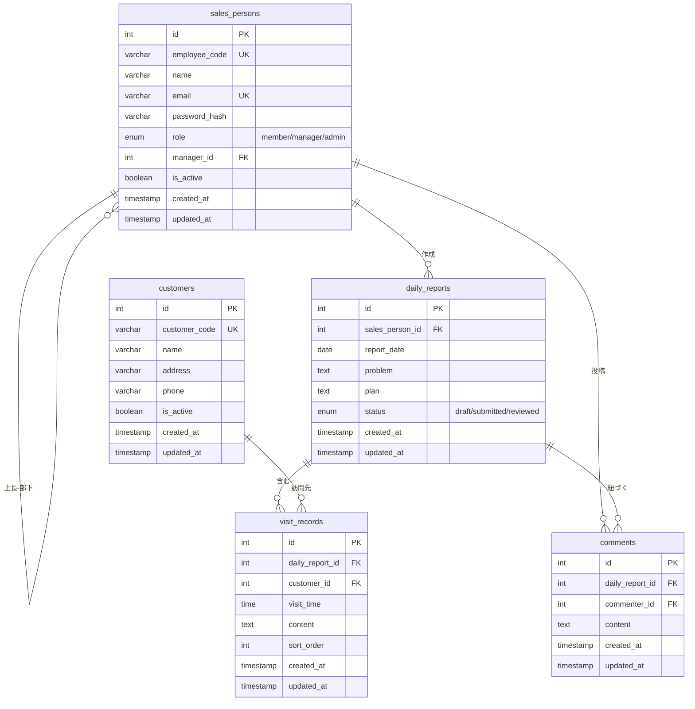
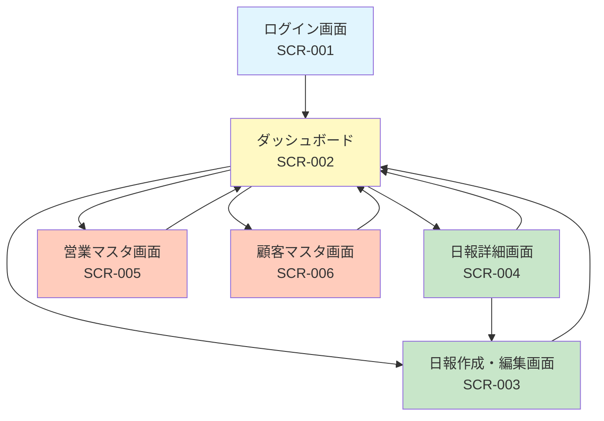

# 営業日報システム 要件定義書

## 1. システム概要

営業担当者が日々の活動報告を行い、上長がフィードバックを行うための日報管理システム。

## 2. 機能要件

### 2.1 日報管理機能

| 機能ID | 機能名 | 説明 |
|--------|--------|------|
| F-001 | 日報作成 | 営業担当者が日報を新規作成する |
| F-002 | 日報編集 | 作成済みの日報を編集する |
| F-003 | 日報閲覧 | 日報の詳細を閲覧する |
| F-004 | 日報一覧 | 日報の一覧を表示する（検索・フィルタ機能含む） |

### 2.2 訪問記録機能

| 機能ID | 機能名 | 説明 |
|--------|--------|------|
| F-010 | 訪問記録登録 | 1日につき複数の顧客訪問記録を登録する |
| F-011 | 訪問記録編集 | 登録済みの訪問記録を編集・削除する |

### 2.3 Problem/Plan機能

| 機能ID | 機能名 | 説明 |
|--------|--------|------|
| F-020 | Problem登録 | 現在の課題・相談事項を自由テキストで記載 |
| F-021 | Plan登録 | 明日やることを自由テキストで記載 |

### 2.4 コメント機能

| 機能ID | 機能名 | 説明 |
|--------|--------|------|
| F-030 | コメント投稿 | 上長が日報に対してコメントを投稿する |
| F-031 | コメント編集 | 投稿済みコメントを編集・削除する |
| F-032 | コメント閲覧 | 日報に紐づくコメント一覧を表示する |

### 2.5 マスタ管理機能

| 機能ID | 機能名 | 説明 |
|--------|--------|------|
| F-040 | 営業マスタ管理 | 営業担当者の登録・編集・削除 |
| F-041 | 顧客マスタ管理 | 顧客の登録・編集・削除 |

## 3. 非機能要件

### 3.1 ユーザー権限

| 権限 | 日報作成 | 日報閲覧 | コメント投稿 | マスタ管理 |
|------|----------|----------|--------------|------------|
| 一般営業 | 自分のみ | 自分のみ | × | × |
| 上長 | 自分のみ | 部下含む | ○ | × |
| 管理者 | ○ | 全員分 | ○ | ○ |

## 4. データ項目定義

### 4.1 営業マスタ（sales_persons）

| 項目名 | 論理名 | 型 | 必須 | 備考 |
|--------|--------|-----|------|------|
| id | 営業ID | INTEGER | ○ | PK, AUTO_INCREMENT |
| employee_code | 社員番号 | VARCHAR(20) | ○ | UNIQUE |
| name | 氏名 | VARCHAR(100) | ○ | |
| email | メールアドレス | VARCHAR(255) | ○ | UNIQUE |
| password_hash | パスワードハッシュ | VARCHAR(255) | ○ | |
| role | 役職 | ENUM | ○ | 'member', 'manager', 'admin' |
| manager_id | 上長ID | INTEGER | | FK(sales_persons.id) |
| is_active | 有効フラグ | BOOLEAN | ○ | DEFAULT: true |
| created_at | 作成日時 | TIMESTAMP | ○ | |
| updated_at | 更新日時 | TIMESTAMP | ○ | |

### 4.2 顧客マスタ（customers）

| 項目名 | 論理名 | 型 | 必須 | 備考 |
|--------|--------|-----|------|------|
| id | 顧客ID | INTEGER | ○ | PK, AUTO_INCREMENT |
| customer_code | 顧客コード | VARCHAR(20) | ○ | UNIQUE |
| name | 顧客名 | VARCHAR(200) | ○ | |
| address | 住所 | VARCHAR(500) | | |
| phone | 電話番号 | VARCHAR(20) | | |
| is_active | 有効フラグ | BOOLEAN | ○ | DEFAULT: true |
| created_at | 作成日時 | TIMESTAMP | ○ | |
| updated_at | 更新日時 | TIMESTAMP | ○ | |

### 4.3 日報（daily_reports）

| 項目名 | 論理名 | 型 | 必須 | 備考 |
|--------|--------|-----|------|------|
| id | 日報ID | INTEGER | ○ | PK, AUTO_INCREMENT |
| sales_person_id | 営業ID | INTEGER | ○ | FK(sales_persons.id) |
| report_date | 報告日 | DATE | ○ | |
| problem | 課題・相談 | TEXT | | |
| plan | 明日やること | TEXT | | |
| status | ステータス | ENUM | ○ | 'draft', 'submitted', 'reviewed' |
| created_at | 作成日時 | TIMESTAMP | ○ | |
| updated_at | 更新日時 | TIMESTAMP | ○ | |

### 4.4 訪問記録（visit_records）

| 項目名 | 論理名 | 型 | 必須 | 備考 |
|--------|--------|-----|------|------|
| id | 訪問記録ID | INTEGER | ○ | PK, AUTO_INCREMENT |
| daily_report_id | 日報ID | INTEGER | ○ | FK(daily_reports.id) |
| customer_id | 顧客ID | INTEGER | ○ | FK(customers.id) |
| visit_time | 訪問時刻 | TIME | | |
| content | 訪問内容 | TEXT | ○ | |
| sort_order | 表示順 | INTEGER | ○ | DEFAULT: 0 |
| created_at | 作成日時 | TIMESTAMP | ○ | |
| updated_at | 更新日時 | TIMESTAMP | ○ | |

### 4.5 コメント（comments）

| 項目名 | 論理名 | 型 | 必須 | 備考 |
|--------|--------|-----|------|------|
| id | コメントID | INTEGER | ○ | PK, AUTO_INCREMENT |
| daily_report_id | 日報ID | INTEGER | ○ | FK(daily_reports.id) |
| commenter_id | コメント者ID | INTEGER | ○ | FK(sales_persons.id) |
| content | コメント内容 | TEXT | ○ | |
| created_at | 作成日時 | TIMESTAMP | ○ | |
| updated_at | 更新日時 | TIMESTAMP | ○ | |

## 5. ER図



## 6. 画面一覧

| 画面ID | 画面名 | 説明 |
|--------|--------|------|
| SCR-001 | ログイン画面 | ユーザー認証 |
| SCR-002 | ダッシュボード | 日報一覧・サマリ表示 |
| SCR-003 | 日報作成画面 | 新規日報の入力 |
| SCR-004 | 日報詳細画面 | 日報の閲覧・コメント |
| SCR-005 | 営業マスタ画面 | 営業担当者の管理 |
| SCR-006 | 顧客マスタ画面 | 顧客の管理 |

## 7. 制約事項

- 同一営業担当者・同一日付の日報は1件のみ作成可能
- 日報削除時は関連する訪問記録・コメントも削除される（論理削除推奨）
- 上長は自分の部下の日報のみ閲覧・コメント可能

## 8. 使用技術

| カテゴリ | 技術 |
|----------|------|
| 言語 | TypeScript |
| Webフレームワーク | Next.js (App Router) |
| UIコンポーネント | shadcn/ui |
| API仕様 | OpenAPI (Zodによる検証) |
| データベーススキーマ | Prisma |
| テストフレームワーク | Vitest |
| デプロイ | Google Cloud Cloud Run |

## 9. 画面設計

詳細: [docs/screen-definition.md](docs/screen-definition.md)

### 9.1 画面一覧

| 画面ID | 画面名 | URL | 権限 |
|--------|--------|-----|------|
| SCR-001 | ログイン画面 | /login | 全員 |
| SCR-002 | ダッシュボード | / | 認証済み |
| SCR-003 | 日報作成・編集画面 | /reports/new, /reports/:id/edit | 認証済み |
| SCR-004 | 日報詳細画面 | /reports/:id | 認証済み |
| SCR-005 | 営業マスタ画面 | /admin/sales-persons | 管理者 |
| SCR-006 | 顧客マスタ画面 | /admin/customers | 管理者 |

### 9.2 画面遷移図



### 9.3 共通コンポーネント

- **ヘッダー**: ロゴ、ユーザー名、ログアウトボタン
- **ナビゲーション**: ダッシュボード、マスタ管理（管理者のみ）
- **共通ダイアログ**: 確認ダイアログ、エラーダイアログ、成功通知（トースト）

## 10. API仕様

詳細: [docs/api-specification.md](docs/api-specification.md)

### 10.1 共通仕様

- ベースURL: `/api/v1`
- 認証方式: Bearer Token (JWT)
- レスポンス形式: JSON

### 10.2 API一覧

| メソッド | エンドポイント | 説明 | 権限 |
|----------|----------------|------|------|
| POST | /api/v1/auth/login | ログイン | 全員 |
| POST | /api/v1/auth/logout | ログアウト | 認証済み |
| GET | /api/v1/auth/me | 現在のユーザー情報取得 | 認証済み |
| GET | /api/v1/reports | 日報一覧取得 | 認証済み |
| POST | /api/v1/reports | 日報作成 | 認証済み |
| GET | /api/v1/reports/{id} | 日報詳細取得 | 認証済み |
| PUT | /api/v1/reports/{id} | 日報更新 | 本人 |
| DELETE | /api/v1/reports/{id} | 日報削除 | 本人 |
| GET | /api/v1/reports/{report_id}/comments | コメント一覧取得 | 認証済み |
| POST | /api/v1/reports/{report_id}/comments | コメント投稿 | 上長・管理者 |
| PUT | /api/v1/comments/{id} | コメント更新 | 投稿者 |
| DELETE | /api/v1/comments/{id} | コメント削除 | 投稿者 |
| GET | /api/v1/sales-persons | 営業一覧取得 | 認証済み |
| POST | /api/v1/sales-persons | 営業登録 | 管理者 |
| GET | /api/v1/sales-persons/{id} | 営業詳細取得 | 認証済み |
| PUT | /api/v1/sales-persons/{id} | 営業更新 | 管理者 |
| DELETE | /api/v1/sales-persons/{id} | 営業削除 | 管理者 |
| GET | /api/v1/customers | 顧客一覧取得 | 認証済み |
| POST | /api/v1/customers | 顧客登録 | 管理者 |
| GET | /api/v1/customers/{id} | 顧客詳細取得 | 認証済み |
| PUT | /api/v1/customers/{id} | 顧客更新 | 管理者 |
| DELETE | /api/v1/customers/{id} | 顧客削除 | 管理者 |

### 10.3 共通エラーコード

| HTTPステータス | コード | 説明 |
|----------------|--------|------|
| 400 | BAD_REQUEST | リクエストが不正 |
| 401 | UNAUTHORIZED | 認証が必要 |
| 403 | FORBIDDEN | 権限がない |
| 404 | NOT_FOUND | リソースが見つからない |
| 409 | CONFLICT | リソースが競合 |
| 422 | VALIDATION_ERROR | バリデーションエラー |
| 500 | INTERNAL_ERROR | サーバーエラー |

## 11. テスト仕様

詳細: [docs/test-specification.md](docs/test-specification.md)

### 11.1 テスト方針

| 項目 | 内容 |
|------|------|
| テストフレームワーク | Vitest |
| E2Eテスト | Playwright |
| カバレッジ目標 | 80%以上 |

### 11.2 テストレベル

| レベル | 対象 | ツール |
|--------|------|--------|
| 単体テスト | 関数、ユーティリティ、カスタムフック | Vitest |
| 結合テスト | APIエンドポイント、データベース連携 | Vitest + Prisma |
| E2Eテスト | 画面操作、ユーザーシナリオ | Playwright |

### 11.3 テストケース概要

| カテゴリ | テストケース数 |
|----------|----------------|
| 単体テスト（ユーティリティ） | 約20件 |
| 結合テスト（API） | 約50件 |
| E2Eテスト（シナリオ） | 約15件 |
| 非機能テスト | 約15件 |

### 11.4 テスト実行コマンド

```bash
# 単体テスト実行
npm run test

# 単体テスト（カバレッジ付き）
npm run test:coverage

# E2Eテスト実行
npm run test:e2e
```

### 11.5 テスト完了基準

| 項目 | 基準 |
|------|------|
| 単体テスト | 全テストパス、カバレッジ80%以上 |
| 結合テスト | 全テストパス |
| E2Eテスト | 主要シナリオ全パス |
| セキュリティテスト | 致命的な脆弱性なし |
| パフォーマンステスト | 目標値達成 |
