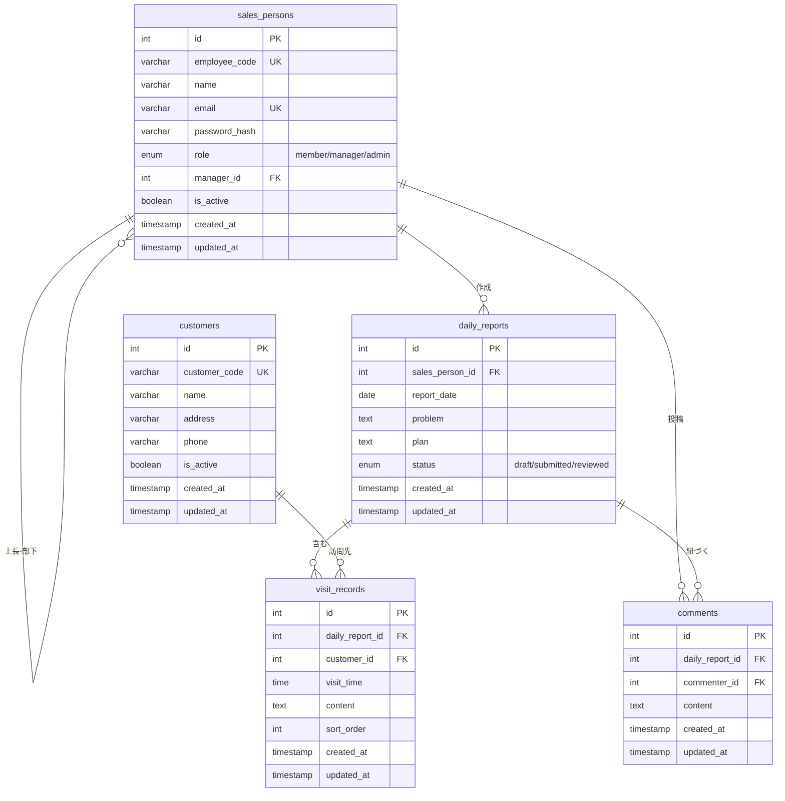

# 営業日報システム ER図

## エンティティ一覧

| エンティティ | 説明 |
|--------------|------|
| sales_persons | 営業担当者マスタ（上長も含む） |
| customers | 顧客マスタ |
| daily_reports | 日報 |
| visit_records | 訪問記録 |
| comments | コメント |

## ER図

## リレーション説明

| 関係 | 説明 |
|------|------|
| sales_persons → sales_persons | 上長-部下の階層関係（自己参照） |
| sales_persons → daily_reports | 営業担当者が日報を作成（1:N） |
| sales_persons → comments | 営業担当者（上長）がコメントを投稿（1:N） |
| daily_reports → visit_records | 日報に複数の訪問記録を含む（1:N） |
| daily_reports → comments | 日報に複数のコメントが紐づく（1:N） |
| customers → visit_records | 顧客が訪問先として記録される（1:N） |
