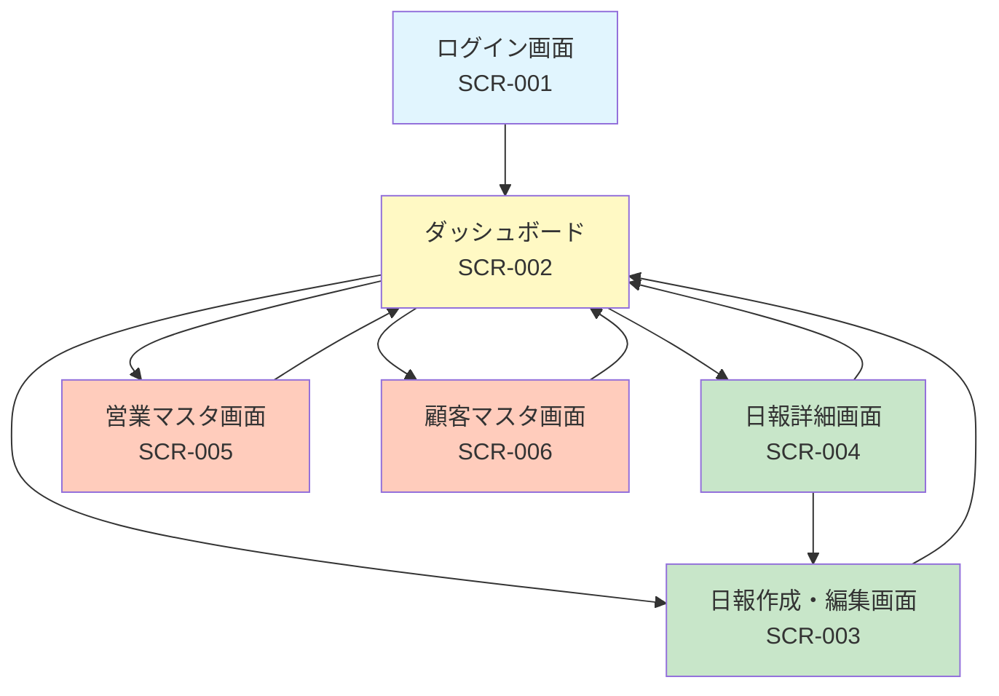

# 営業日報システム 画面定義書

## 画面一覧

| 画面ID | 画面名 | URL | 権限 |
|--------|--------|-----|------|
| SCR-001 | ログイン画面 | /login | 全員 |
| SCR-002 | ダッシュボード | / | 認証済み |
| SCR-003 | 日報作成・編集画面 | /reports/new, /reports/:id/edit | 認証済み |
| SCR-004 | 日報詳細画面 | /reports/:id | 認証済み |
| SCR-005 | 営業マスタ画面 | /admin/sales-persons | 管理者 |
| SCR-006 | 顧客マスタ画面 | /admin/customers | 管理者 |

---

## SCR-001: ログイン画面

### 概要
システムへのログイン認証を行う画面。

### 画面レイアウト

```
+--------------------------------------------------+
|                                                  |
|              営業日報システム                      |
|                                                  |
|        +------------------------------+          |
|        | メールアドレス                 |          |
|        +------------------------------+          |
|                                                  |
|        +------------------------------+          |
|        | パスワード                    |          |
|        +------------------------------+          |
|                                                  |
|        [        ログイン        ]                |
|                                                  |
|        エラーメッセージ表示エリア                  |
|                                                  |
+--------------------------------------------------+
```

### 入力項目

| 項目名 | 項目ID | 型 | 必須 | 最大長 | バリデーション |
|--------|--------|-----|------|--------|----------------|
| メールアドレス | email | text | ○ | 255 | メール形式 |
| パスワード | password | password | ○ | 100 | - |

### ボタン・アクション

| ボタン名 | アクション | 遷移先 |
|----------|------------|--------|
| ログイン | 認証処理実行 | 成功時: ダッシュボード (SCR-002) |

### エラーメッセージ

| コード | メッセージ |
|--------|------------|
| E001 | メールアドレスを入力してください |
| E002 | パスワードを入力してください |
| E003 | メールアドレスまたはパスワードが正しくありません |
| E004 | アカウントが無効化されています |

---

## SCR-002: ダッシュボード

### 概要
日報一覧の表示、検索、新規作成への導線を提供するメイン画面。

### 画面レイアウト

```
+------------------------------------------------------------------+
| [ロゴ]  営業日報システム          [ユーザー名 ▼] [ログアウト]      |
+------------------------------------------------------------------+
| ナビゲーション: [ダッシュボード] [マスタ管理 ▼]                    |
+------------------------------------------------------------------+
|                                                                  |
|  日報一覧                                    [+ 新規作成]        |
|                                                                  |
|  +------------------------------------------------------------+  |
|  | 検索条件                                                   |  |
|  | 期間: [開始日] 〜 [終了日]  担当者: [選択 ▼]  [検索]        |  |
|  +------------------------------------------------------------+  |
|                                                                  |
|  +------------------------------------------------------------+  |
|  | 日付       | 担当者     | 訪問件数 | ステータス | 操作     |  |
|  |------------|------------|----------|------------|----------|  |
|  | 2025/01/15 | 山田太郎   | 3件      | 提出済     | [詳細]   |  |
|  | 2025/01/14 | 山田太郎   | 2件      | レビュー済 | [詳細]   |  |
|  | 2025/01/13 | 鈴木花子   | 4件      | 下書き     | [詳細]   |  |
|  +------------------------------------------------------------+  |
|                                                                  |
|  [< 前へ]  1 / 10 ページ  [次へ >]                               |
|                                                                  |
+------------------------------------------------------------------+
```

### 検索条件

| 項目名 | 項目ID | 型 | 初期値 |
|--------|--------|-----|--------|
| 開始日 | start_date | date | 当月1日 |
| 終了日 | end_date | date | 本日 |
| 担当者 | sales_person_id | select | 自分（上長の場合は「全員」） |

### 一覧表示項目

| 項目名 | 説明 |
|--------|------|
| 日付 | 報告日（YYYY/MM/DD形式） |
| 担当者 | 営業担当者名 |
| 訪問件数 | 訪問記録の件数 |
| ステータス | 下書き/提出済/レビュー済 |
| 操作 | 詳細ボタン |

### ボタン・アクション

| ボタン名 | アクション | 遷移先 |
|----------|------------|--------|
| 新規作成 | 日報作成画面へ遷移 | SCR-003 |
| 検索 | 条件で一覧を絞り込み | - |
| 詳細 | 日報詳細画面へ遷移 | SCR-004 |

---

## SCR-003: 日報作成・編集画面

### 概要
日報の新規作成および編集を行う画面。訪問記録を複数登録可能。

### 画面レイアウト

```
+------------------------------------------------------------------+
| [ロゴ]  営業日報システム          [ユーザー名 ▼] [ログアウト]      |
+------------------------------------------------------------------+
|                                                                  |
|  日報作成                         [下書き保存] [提出]            |
|                                                                  |
|  報告日: [2025/01/15]                                            |
|                                                                  |
|  ━━━━━━━━━━━━━━━━━━━━━━━━━━━━━━━━━━━━━━━━━━━━━━━━━━━━━━━━━━━    |
|  訪問記録                                        [+ 追加]        |
|  ━━━━━━━━━━━━━━━━━━━━━━━━━━━━━━━━━━━━━━━━━━━━━━━━━━━━━━━━━━━    |
|                                                                  |
|  +------------------------------------------------------------+  |
|  | #1  顧客: [顧客選択 ▼]  訪問時刻: [10:00]           [削除] |  |
|  |     訪問内容:                                              |  |
|  |     +----------------------------------------------------+ |  |
|  |     | 新製品の提案を実施。次回見積もり提出予定。           | |  |
|  |     +----------------------------------------------------+ |  |
|  +------------------------------------------------------------+  |
|                                                                  |
|  +------------------------------------------------------------+  |
|  | #2  顧客: [顧客選択 ▼]  訪問時刻: [14:00]           [削除] |  |
|  |     訪問内容:                                              |  |
|  |     +----------------------------------------------------+ |  |
|  |     |                                                    | |  |
|  |     +----------------------------------------------------+ |  |
|  +------------------------------------------------------------+  |
|                                                                  |
|  ━━━━━━━━━━━━━━━━━━━━━━━━━━━━━━━━━━━━━━━━━━━━━━━━━━━━━━━━━━━    |
|  Problem（課題・相談）                                           |
|  ━━━━━━━━━━━━━━━━━━━━━━━━━━━━━━━━━━━━━━━━━━━━━━━━━━━━━━━━━━━    |
|  +------------------------------------------------------------+  |
|  | A社への提案価格について上長に相談したい。                    |  |
|  | 競合他社の動向が気になる。                                  |  |
|  +------------------------------------------------------------+  |
|                                                                  |
|  ━━━━━━━━━━━━━━━━━━━━━━━━━━━━━━━━━━━━━━━━━━━━━━━━━━━━━━━━━━━    |
|  Plan（明日やること）                                            |
|  ━━━━━━━━━━━━━━━━━━━━━━━━━━━━━━━━━━━━━━━━━━━━━━━━━━━━━━━━━━━    |
|  +------------------------------------------------------------+  |
|  | B社へ見積もり提出                                          |  |
|  | C社アポイント調整                                          |  |
|  +------------------------------------------------------------+  |
|                                                                  |
|                                    [キャンセル] [下書き保存] [提出] |
+------------------------------------------------------------------+
```

### 入力項目

| 項目名 | 項目ID | 型 | 必須 | 最大長 | バリデーション |
|--------|--------|-----|------|--------|----------------|
| 報告日 | report_date | date | ○ | - | 未来日不可、重複不可 |
| Problem | problem | textarea | - | 2000 | - |
| Plan | plan | textarea | - | 2000 | - |

### 訪問記録（複数登録可）

| 項目名 | 項目ID | 型 | 必須 | 最大長 | バリデーション |
|--------|--------|-----|------|--------|----------------|
| 顧客 | customer_id | select | ○ | - | 顧客マスタから選択 |
| 訪問時刻 | visit_time | time | - | - | HH:MM形式 |
| 訪問内容 | content | textarea | ○ | 2000 | - |

### ボタン・アクション

| ボタン名 | アクション | 遷移先 |
|----------|------------|--------|
| 追加 | 訪問記録を1行追加 | - |
| 削除 | 該当の訪問記録を削除 | - |
| キャンセル | 編集を破棄 | SCR-002 |
| 下書き保存 | status=draftで保存 | SCR-002 |
| 提出 | status=submittedで保存 | SCR-002 |

### エラーメッセージ

| コード | メッセージ |
|--------|------------|
| E101 | 報告日を入力してください |
| E102 | この日付の日報は既に存在します |
| E103 | 訪問記録を1件以上登録してください |
| E104 | 顧客を選択してください |
| E105 | 訪問内容を入力してください |

---

## SCR-004: 日報詳細画面

### 概要
日報の詳細表示およびコメント投稿を行う画面。

### 画面レイアウト

```
+------------------------------------------------------------------+
| [ロゴ]  営業日報システム          [ユーザー名 ▼] [ログアウト]      |
+------------------------------------------------------------------+
|                                                                  |
|  日報詳細                                                        |
|  [< 一覧に戻る]                              [編集] ※本人のみ    |
|                                                                  |
|  +------------------------------------------------------------+  |
|  | 報告日: 2025年1月15日（水）                                 |  |
|  | 担当者: 山田太郎                                            |  |
|  | ステータス: [提出済]                                        |  |
|  +------------------------------------------------------------+  |
|                                                                  |
|  ━━━━━━━━━━━━━━━━━━━━━━━━━━━━━━━━━━━━━━━━━━━━━━━━━━━━━━━━━━━    |
|  訪問記録（3件）                                                 |
|  ━━━━━━━━━━━━━━━━━━━━━━━━━━━━━━━━━━━━━━━━━━━━━━━━━━━━━━━━━━━    |
|                                                                  |
|  +------------------------------------------------------------+  |
|  | 10:00  株式会社ABC                                         |  |
|  | 新製品の提案を実施。次回見積もり提出予定。                    |  |
|  +------------------------------------------------------------+  |
|  | 14:00  DEF株式会社                                         |  |
|  | 定期訪問。現状のサービスに満足とのこと。                      |  |
|  +------------------------------------------------------------+  |
|  | 16:30  GHI工業                                             |  |
|  | 新規開拓。担当者不在のため名刺を置いてきた。                  |  |
|  +------------------------------------------------------------+  |
|                                                                  |
|  ━━━━━━━━━━━━━━━━━━━━━━━━━━━━━━━━━━━━━━━━━━━━━━━━━━━━━━━━━━━    |
|  Problem（課題・相談）                                           |
|  ━━━━━━━━━━━━━━━━━━━━━━━━━━━━━━━━━━━━━━━━━━━━━━━━━━━━━━━━━━━    |
|  A社への提案価格について上長に相談したい。                        |
|  競合他社の動向が気になる。                                      |
|                                                                  |
|  ━━━━━━━━━━━━━━━━━━━━━━━━━━━━━━━━━━━━━━━━━━━━━━━━━━━━━━━━━━━    |
|  Plan（明日やること）                                            |
|  ━━━━━━━━━━━━━━━━━━━━━━━━━━━━━━━━━━━━━━━━━━━━━━━━━━━━━━━━━━━    |
|  B社へ見積もり提出                                               |
|  C社アポイント調整                                               |
|                                                                  |
|  ━━━━━━━━━━━━━━━━━━━━━━━━━━━━━━━━━━━━━━━━━━━━━━━━━━━━━━━━━━━    |
|  コメント（2件）                                                 |
|  ━━━━━━━━━━━━━━━━━━━━━━━━━━━━━━━━━━━━━━━━━━━━━━━━━━━━━━━━━━━    |
|                                                                  |
|  +------------------------------------------------------------+  |
|  | 佐藤課長  2025/01/15 18:30                          [削除] |  |
|  | A社の件、明日MTGで相談しましょう。                          |  |
|  +------------------------------------------------------------+  |
|  | 佐藤課長  2025/01/15 18:35                          [削除] |  |
|  | 競合情報はマーケ部にも共有してください。                      |  |
|  +------------------------------------------------------------+  |
|                                                                  |
|  +------------------------------------------------------------+  |
|  | コメントを入力...                                          |  |
|  +------------------------------------------------------------+  |
|  [コメント投稿]                                                  |
|                                                                  |
+------------------------------------------------------------------+
```

### 表示項目

| 項目名 | 説明 |
|--------|------|
| 報告日 | YYYY年MM月DD日（曜日）形式 |
| 担当者 | 営業担当者名 |
| ステータス | 下書き/提出済/レビュー済（バッジ表示） |
| 訪問記録 | 時刻、顧客名、内容をカード形式で表示 |
| Problem | 課題・相談内容 |
| Plan | 明日やること |
| コメント | 投稿者、日時、内容の一覧 |

### コメント入力

| 項目名 | 項目ID | 型 | 必須 | 最大長 |
|--------|--------|-----|------|--------|
| コメント | comment_content | textarea | ○ | 1000 |

### ボタン・アクション

| ボタン名 | アクション | 権限 | 遷移先 |
|----------|------------|------|--------|
| 一覧に戻る | ダッシュボードへ遷移 | 全員 | SCR-002 |
| 編集 | 日報編集画面へ遷移 | 本人のみ | SCR-003 |
| コメント投稿 | コメントを保存 | 上長・管理者 | - |
| 削除（コメント） | コメントを削除 | 投稿者本人 | - |

---

## SCR-005: 営業マスタ画面

### 概要
営業担当者の一覧表示、登録、編集、削除を行う管理画面。

### 画面レイアウト

```
+------------------------------------------------------------------+
| [ロゴ]  営業日報システム          [ユーザー名 ▼] [ログアウト]      |
+------------------------------------------------------------------+
| ナビゲーション: [ダッシュボード] [マスタ管理 ▼]                    |
+------------------------------------------------------------------+
|                                                                  |
|  営業マスタ管理                              [+ 新規登録]        |
|                                                                  |
|  +------------------------------------------------------------+  |
|  | 社員番号 | 氏名     | メール           | 役職   | 上長     | 状態 | 操作      |
|  |----------|----------|------------------|--------|----------|------|-----------|
|  | EMP001   | 山田太郎 | yamada@example   | 一般   | 佐藤課長 | 有効 | [編集][削除] |
|  | EMP002   | 鈴木花子 | suzuki@example   | 一般   | 佐藤課長 | 有効 | [編集][削除] |
|  | EMP003   | 佐藤次郎 | sato@example     | 上長   | -        | 有効 | [編集][削除] |
|  +------------------------------------------------------------+  |
|                                                                  |
+------------------------------------------------------------------+

【登録/編集モーダル】
+------------------------------------------+
|  営業担当者 登録/編集                 [×] |
+------------------------------------------+
|  社員番号:  [EMP004        ]              |
|  氏名:      [田中一郎       ]              |
|  メール:    [tanaka@example ]              |
|  パスワード: [********      ] ※新規時必須  |
|  役職:      [一般 ▼]                      |
|  上長:      [佐藤次郎 ▼]                   |
|  状態:      [○ 有効  ○ 無効]              |
|                                          |
|            [キャンセル] [保存]            |
+------------------------------------------+
```

### 一覧表示項目

| 項目名 | 説明 |
|--------|------|
| 社員番号 | 一意の識別子 |
| 氏名 | 営業担当者名 |
| メール | メールアドレス（一部マスク可） |
| 役職 | 一般/上長/管理者 |
| 上長 | 上長の氏名（設定されている場合） |
| 状態 | 有効/無効 |

### 登録・編集項目

| 項目名 | 項目ID | 型 | 必須 | 最大長 | バリデーション |
|--------|--------|-----|------|--------|----------------|
| 社員番号 | employee_code | text | ○ | 20 | 半角英数字、重複不可 |
| 氏名 | name | text | ○ | 100 | - |
| メールアドレス | email | text | ○ | 255 | メール形式、重複不可 |
| パスワード | password | password | △ | 100 | 新規時必須、8文字以上 |
| 役職 | role | select | ○ | - | member/manager/admin |
| 上長 | manager_id | select | - | - | 営業マスタから選択 |
| 状態 | is_active | radio | ○ | - | true/false |

### ボタン・アクション

| ボタン名 | アクション |
|----------|------------|
| 新規登録 | 登録モーダルを表示 |
| 編集 | 編集モーダルを表示 |
| 削除 | 削除確認後、論理削除（is_active=false） |
| 保存 | 入力内容を保存 |

---

## SCR-006: 顧客マスタ画面

### 概要
顧客の一覧表示、登録、編集、削除を行う管理画面。

### 画面レイアウト

```
+------------------------------------------------------------------+
| [ロゴ]  営業日報システム          [ユーザー名 ▼] [ログアウト]      |
+------------------------------------------------------------------+
| ナビゲーション: [ダッシュボード] [マスタ管理 ▼]                    |
+------------------------------------------------------------------+
|                                                                  |
|  顧客マスタ管理                              [+ 新規登録]        |
|                                                                  |
|  +------------------------------------------------------------+  |
|  | 検索: [顧客名・顧客コードで検索...        ] [検索]           |  |
|  +------------------------------------------------------------+  |
|                                                                  |
|  +------------------------------------------------------------+  |
|  | 顧客コード | 顧客名           | 電話番号     | 状態 | 操作      |
|  |------------|------------------|--------------|------|-----------|
|  | C001       | 株式会社ABC      | 03-1234-5678 | 有効 | [編集][削除] |
|  | C002       | DEF株式会社      | 06-9876-5432 | 有効 | [編集][削除] |
|  | C003       | GHI工業          | 045-111-2222 | 無効 | [編集][削除] |
|  +------------------------------------------------------------+  |
|                                                                  |
|  [< 前へ]  1 / 5 ページ  [次へ >]                                |
|                                                                  |
+------------------------------------------------------------------+

【登録/編集モーダル】
+------------------------------------------+
|  顧客 登録/編集                       [×] |
+------------------------------------------+
|  顧客コード: [C004           ]            |
|  顧客名:     [JKL商事株式会社 ]            |
|  住所:       [東京都港区...   ]            |
|  電話番号:   [03-xxxx-xxxx   ]            |
|  状態:       [○ 有効  ○ 無効]            |
|                                          |
|            [キャンセル] [保存]            |
+------------------------------------------+
```

### 一覧表示項目

| 項目名 | 説明 |
|--------|------|
| 顧客コード | 一意の識別子 |
| 顧客名 | 会社名・団体名 |
| 電話番号 | 連絡先電話番号 |
| 状態 | 有効/無効 |

### 登録・編集項目

| 項目名 | 項目ID | 型 | 必須 | 最大長 | バリデーション |
|--------|--------|-----|------|--------|----------------|
| 顧客コード | customer_code | text | ○ | 20 | 半角英数字、重複不可 |
| 顧客名 | name | text | ○ | 200 | - |
| 住所 | address | text | - | 500 | - |
| 電話番号 | phone | text | - | 20 | 電話番号形式 |
| 状態 | is_active | radio | ○ | - | true/false |

### ボタン・アクション

| ボタン名 | アクション |
|----------|------------|
| 検索 | 顧客名・顧客コードで部分一致検索 |
| 新規登録 | 登録モーダルを表示 |
| 編集 | 編集モーダルを表示 |
| 削除 | 削除確認後、論理削除（is_active=false） |
| 保存 | 入力内容を保存 |

---

## 画面遷移図



---

## 共通コンポーネント

### ヘッダー
- ロゴ・システム名
- ユーザー名表示（ドロップダウン）
- ログアウトボタン

### ナビゲーション
- ダッシュボード
- マスタ管理（管理者のみ表示）
  - 営業マスタ
  - 顧客マスタ

### フッター
- コピーライト表示

### 共通ダイアログ
- 確認ダイアログ（削除確認等）
- エラーダイアログ
- 成功通知（トースト）
